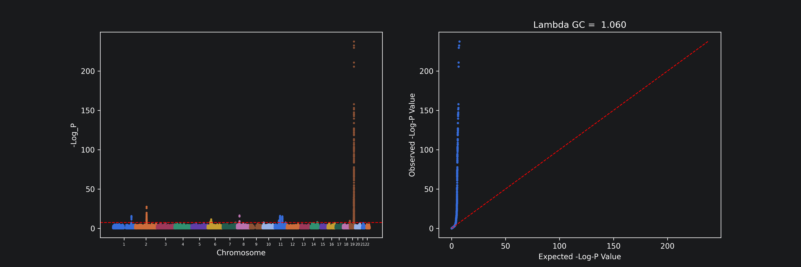
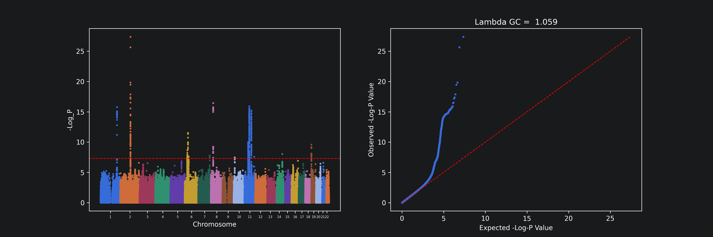

# Simple fine-mapping and functional annotation of Alzheimer's risk loci
**About:** This project takes public Alzheimer's summary statistics and identifies risk loci, and then annotates the genes and tissues they implicate.

### Question
What are the leading risk loci for Alzheimer's disease other than those associated with the APOE gene, which has an outsized effect on such analyses, and which genes are they associated with, by proximity and by brain eQTL evidence?

### Data
| Input                   | Source                                                 | Build         | Notes                                                                        | Reference                                                                                            |
|-------------------------|--------------------------------------------------------|---------------|------------------------------------------------------------------------------|------------------------------------------------------------------------------------------------------|
| GWAS Summary Statistics | Kunkle et al. 2019, GWAS Catalog GCST007511            | GRCh37 / hg19 | ~11.5 million variants; 21,982 Alzheimer's disease cases and 41,944 controls | [Kunkle et al. (2019)](https://doi.org/10.1038/s41588-019-0358-2)                                   |
| LD Reference Panel      | 1000 Genomes Phase 3, EUR subset (built with PLINK1.9) | hg19          | ~9.5 million SNPs; 503 individuals across 5 subsamples; SNP-only             | [The 1000 Genomes Project Consortium (2015)](https://doi.org/10.1038/nature15393)                    |
| LDSC Reference Panel    | eur_w_ld_chr, w_hm3.snplist                            | hg19          | LD scores and HapMap3 SNP list                                               | [Bulik-Sullivan et al. (2015)](https://doi.org/10.1038/ng.3211)                                      |
| Gene Annotation         | UCSC RefSeq (refGene)                                  | hg19          | Used for nearest-gene mapping                                                | [Casper et al. (2025)](https://doi.org/10.1093/nar/gkaf1250)                                         |
| Regulatory Annotation   | GTEx brain eQTLs (via the GTEx Portal API)             | N/A           | 13 brain tissues                                                             | [Londsdale et al. (2013)](https://doi.org/10.1093/nar/gkaf1250), Portal Link: https://gtexportal.org |

**Note:** Raw data is not committed (see .gitignore); the table above is sufficient to obtain every input. 

### Software
| Tool     | Version      | Purpose                                            | Reference                                                                                            |
|----------|--------------|----------------------------------------------------|------------------------------------------------------------------------------------------------------|
| PLINK    | 1.9.0-b.7.11 | LD clumping                                        | [Chang et al. (2015)](https://doi.org/10.1186/s13742-015-0047-8)                                     |
| LDSC     | 1.0.1        | Heritability and confounding (LD Score Regression) | [Bulik-Sullivan et al. (2015)](https://doi.org/10.1038/ng.3211)                                      |
| BEDtools | 2.31.1       | Nearest-gene annotation                            | [Quinlan and Hall (2010)](https://doi.org/10.1093/bioinformatics/btq033)                             |
| GTEx API | v2           | Brain eQTL lookup                                  | [Londsdale et al. (2013)](https://doi.org/10.1093/nar/gkaf1250), Portal Link: https://gtexportal.org |

### Method
**Step 1 - Data Processing:** Summary statistics were loaded and validated (e.g. we confirm that there are no missing p-values and all p-values fall between 0 and 1). Manhattan and QQ plots were generated to assess the overall quality of the data.

**Step 2 - Evaluating Heritability and Confounding Factors:** Genomic inflation was assessed with the QQ plot and the λ_GC value (which was around 1.06). LD Score Regression (LDSC) was then used to distinguish true polygenic signal from confounding factors. The mean χ² value of 1.117 and the LDSC λ_GC value of 1.091 indicate genuine inflation, while the max χ² value of 689.9 indicates very strong genome-wide significant loci. Alzheimer's lacks a single agreed population prevalence, so LDSC was run across a range of prevalence values. The intercept was around 1.03, which indicates inflation primarily due to polygenicity.

**Step 3 - Quality Control + Preparing Data for Clumping:** Variants were QC'ed for clumping. P-values of exactly zero were floored to the smallest representable value, missing SNP IDs were dropped, and only SNPs with valid rsIDs were kept.

**Step 4 - Clumping:** LD clumping on PLINK grouped correlated SNPs around lead association signals. Conventional fine-mapping parameters were used: a standard genome-wide significance threshold of 5x10e-8, a secondary threshold of 0.01, a 500 kb window size, and an r^2 value of 0.1. This yielded 72 loci, of which 55 fell on Chromosome 19, where the APOE locus is. It raised the central question: is APOE's extensive LD distorting the locus count? What happens if it's removed?

**Step 5 - No-APOE Analysis:** To isolate non-APOE signal, variants on Chromosome 19 between 44,400,000 and 46,400,000 bp (a wider window around the APOE gene to capture its extended LD) were excised. This removed 8,280 variants, the minimum p-value shifted from 0 (underflow at APOE) to 4.0x10e-28, and additional peaks were observed (notably on Chromosomes 2 and 11). Rerunning LDSC gave a mean χ² value of 1.105, a λ_GC value of 1.09, and an intercept of 1.025 (with a standard error of 0.007), all of which point to polygenicity. Liability-scale heritability decreased slightly when compared to the full data; while APOE does contribute to Alzheimer's genetic risk, much of the heritability can be attributed to loci elsewhere. Re-clumping with the same parameters yielded 19 loci, of which only 2 were on Chromosome 19, and 5 were on Chromosome 11.

**Step 6 - Functional Annotation, Pass 1:** Loci were annotated to their nearest gene using bedtools closest against UCSD RefSeq gene coordinates (hg19). The no-APOE lead-SNP BED file (-a) was annotated against the gene BED file (-b), returning the nearest gene and its distance per lead SNP.

**Step 7 - Functional Annotation, Pass 2:** Proximity by itself can be misleading since loci may regulate distant genes. In this step, loci were additionally annotated with brain eQTL evidence via the GTEx API. Genes whose expression is significantly associated with SNPs across the brain tissue were returned. 

### Findings 
Initial LD clumping found 72 independent risk loci. Of these, 55 fell on Chromosome 19, and the overwhelming majority within the APOE region. After excising APOE and re-clumping, 19 loci remained, and only 2 of them on Chromosome 19.

Nearest-gene annotation (Pass 1) was applied to these 19 loci. One (rs34467936) could not be annotated, since it was absent from the reference gene BED file. 18 had an assigned nearest gene. Several of these are widely accepted as canonical Alzheimer's genes, including ABCA7, BIN1, CD2AP, CLU, CR1, EPHA1, MS4A4E, and SORL1.

Pass 2 then queried GTEx for brain eQTLs to ask a sharper question — does each locus actually regulate its nearest gene? Of the 18 loci, 12 had a detectable brain eQTL; of these 12, only in 5 did the nearest gene actually appear among the eQTL-linked genes. For the majority, physical proximity did not identify the regulated gene. Two of the eQTL-implicated genes (ENSG00000286971 at rs6733839, ENSG00000279742 at rs3851179) are uncharacterized.

| SNP         | Pass 1 - Nearest Gene | Pass 2 - Top eQTL Gene | Pass 2 - Tissue                       | Pass 1 - Distance |
|-------------|-----------------------|------------------------|---------------------------------------|-------------------|
| rs679515    | CR1                   | CR1                    | Brain_Caudate_basal_ganglia           | 0                 |
| rs867230    | CLU                   | CLU                    | Brain_Nucleus_accumbens_basal_ganglia | 0                 |
| rs73223431  | PTK2B                 | CHRNA2                 | Brain_Cerebellum                      | 0                 |
| rs11767557  | EPHA1-AS1             | TCAF2                  | Brain_Nucleus_accumbens_basal_ganglia | 0                 |
| rs114812713 | OARD1                 | NaN                    | NaN                                   | 0                 |
| rs10200967  | BIN1                  | BIN1                   | Brain_Cerebellum                      | 0                 |
| rs12151021  | ABCA7                 | ARHGAP45               | Brain_Cerebellum                      | 0                 |
| rs4147910   | ABCA7                 | RNU6-2                 | Brain_Nucleus_accumbens_basal_ganglia | 0                 |
| rs12590654  | SLC24A4               | RIN3                   | Brain_Putamen_basal_ganglia           | 0                 |
| rs11218343  | SORL1                 | NaN                    | NaN                                   | 0                 |
| rs3740688   | SPI1                  | MTCH2                  | Brain_Nucleus_accumbens_basal_ganglia | 0                 |
| rs1385742   | CD2AP                 | NaN                    | NaN                                   | 159               |
| rs34665982  | HLA-DRB1              | NaN                    | NaN                                   | 2693              |
| rs1582763   | MS4A4E                | NaN                    | NaN                                   | 11338             |
| rs6710467   | BIN1                  | BIN1                   | Brain_Nucleus_accumbens_basal_ganglia | 25202             |
| rs6733839   | BIN1                  | ENSG00000286971        | Brain_Spinal_cord_cervical_c-1        | 28080             |
| rs12416487  | ECHDC3                | NaN                    | NaN                                   | 63324             |
| rs3851179   | EED                   | ENSG00000279742        | Brain_Cortex                          | 86786             |

Excising APOE led to consistent, interpretable changes in the LDSC statistics. The prevalence-independent metrics were unchanged between prevalence values:

| Metric    | Full (with APOE)   | No-APOE            |
|-----------|--------------------|--------------------|
| Lambda GC | 1.0926             | 1.0926             |
| Mean χ²   | 1.118              | 1.1061             |
| Intercept | 1.0302 (SE 0.0084) | 1.0253 (SE 0.0066) |
| Ratio     | 0.256 (SE 0.0714)  | 0.2383 (SE 0.0625) |

Liability-scale heritability, which does depend on assumed population prevalence, was reported across a plausible range:

| Population prevalence | Full (with APOE) h² | No-APOE h²         |
|-----------------------|---------------------|--------------------|
| 0.05                  | 0.067 (SE 0.0107)   | 0.0604 (SE 0.0093) |
| 0.10                  | 0.0831 (SE 0.0133)  | 0.0749 (SE 0.0115) |
| 0.15                  | 0.0945 (SE 0.0151)  | 0.0852 (SE 0.0131) |
| 0.20                  | 0.1032 (SE 0.0165)  | 0.093 (SE 0.0143)  |

In both models the intercept was near 1 (1.0302 full; 1.0253 no-APOE), indicating that inflation is driven predominantly by polygenic signal rather than confounding. Excluding the APOE locus produced a modest decrease in liability-scale heritability across all prevalence values — so while APOE contributes substantially to Alzheimer's disease risk, a large proportion of common-variant heritability is attributable to loci elsewhere in the genome.

### Graphs
**Manhattan and QQ plots on the full data**

**Manhattan and QQ plots on the no-APOE data**

### Limitations
- The summary statistics from Kunkle et al. are drawn from individuals of European descent, so the results may not transfer well to other populations.
- This project focused only on single-base substitutions (SNPs), excluding indels and variants without rsIDs, as these could not be reliably matched to the LD reference panel. Some genuine signals reside in the excluded variants. 
- GTEx brain eQTLs are derived from bulk tissue. Variants acting specifically within a minor cell population like microglia may show no detectable bulk-tissue eQTL. Loci lacking eQTLs may still have a regulatory effect. 
- Liability-scale heritability depends on an assumed population prevalence; Alzheimer's has no cleanly defined value (most reported figures apply to specific age groups). This was handled by estimating heritability across a range of plausible prevalence values rather than committing to a single number. 

### Repository Structure
    ├── README.md
    ├── requirements.txt
    ├── ad_gwas_analysis.ipynb
    ├── results/
    │   └── figures/                    
    └── data/                           # gitignored
        ├── raw/
        └── processed/

### Reproduce
    # 1. Python environment
    python -m venv .venv && source .venv/bin/activate
    pip install -r requirements.txt

    # 2. Command-line tools (not pip-installable)
    #    - PLINK 1.9         https://www.cog-genomics.org/plink/
    #    - BEDtools          (brew install bedtools)
    #    - LDSC              https://github.com/bulik/ldsc  (in its own Python 2.7 environment)

    # 3. Obtain the data listed in the Data section into data/raw/

    # 4. Run the notebook top-to-bottom
    jupyter lab notebooks/ad_gwas_analysis.ipynb

### References

Barber, R. C. (2012). The genetics of Alzheimer’s disease. Scientifica, 2012, 246210. https://doi.org/10.6064/2012/246210

Li, H., Zhang, P., Liu, C., Wang, Y., Deng, Y., Dong, W., & Yu, Y. (2022). The structure, function and regulation of protein tyrosine phosphatase receptor type J and its role in diseases. Cells, 12(1), 8. https://doi.org/10.3390/cells12010008

National Center for Biotechnology Information. (n.d.). NUP160, nucleoporin 160 [Homo sapiens] (Gene ID: 23279). NCBI Gene.

Ware, E. B., Faul, J. D., Mitchell, C. M., & Bakulski, K. M. (2020). Considering the APOE locus in Alzheimer’s disease polygenic scores in the Health and Retirement Study: A longitudinal panel study. BMC Medical Genomics, 13, 164. https://doi.org/10.1186/s12920-020-00815-9

### Citations + Attributions
This project uses publicly available datasets and open-source software. Please refer to the linked publications and resources for the appropriate citations and attribution.
